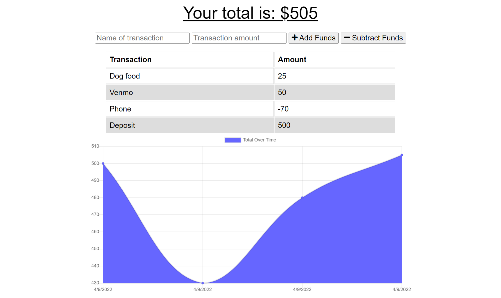

# PWA Budget Tracker  

  ## Table of Contents
  --------------------
  - [Description](#description)
  - [Installations](#installation)
  - [Usage](#usage)
  - [Contributing](#contribution)
  - [Tests](#testing)
  - [License](#licenses)
  - [Questions](#contact)

  ## Description
  --------------
  This application allows you to keep track of your budget anywhere you go! And it's saved locally!

  ## Installation
  ---------------
  No specific installation instructions required for this repo!

  ## Usage
  ---------------------
  There are no usage instructions needed for this project, just hit run and follow prompts!

 

  ## Contribution
  --------------------------
  Contribution is not allowed on this repo!

  ## Testing
  ---------------------
  No Testing Allowed in this program!

  ## Licenses
  ----------------
  
   
  This application is licensed by:   None

  ## Contact!
  --------------
  Just reach out to me with any questions!

  GitHub: [HottieHotton](https://github.com/HottieHotton)

  Email: [Gmail](mailto:bhotton25@gmail.com)